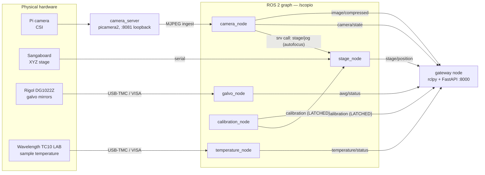

# SCOPIO — software architecture, for the talk

Source material for slides. Facts extracted from the code as it stands on
branch `remake`. Sections marked **[YOURS]** are the ones you said you'd
narrate yourself — I left them as bullet stubs. Everything else is filled in.

---

## 0. The one-slide system map

```
        ┌──────────────────────── RASPBERRY PI 4 (the instrument) ───────────────────────┐
        │                                                                                 │
        │  docker compose, 3 services, network_mode: host, restart: unless-stopped        │
        │                                                                                 │
        │   ┌──────────────┐        ┌──────────────────────────────────────────────────┐  │
        │   │  camera      │        │  scopio   (ROS 2 Jazzy graph, namespace /scopio) │  │
        │   │  bookworm +  │  MJPEG │                                                   │  │
        │   │  picamera2   │◄──────►│  calibration_node  camera_node  stage_node       │  │
        │   │  :8081       │loopback│  galvo_node        temperature_node              │  │
        │   │  LOOPBACK    │        │                                                   │  │
        │   └──────▲───────┘        └───────────────────────▲──────────────────────────┘  │
        │          │                        DDS on localhost │                            │
        │          │  loopback HTTP                          │ rclpy                      │
        │   ┌──────┴─────────────────────────────────────────┴───────────────────────┐    │
        │   │  gateway  —  FastAPI + rclpy in ONE process                             │    │
        │   │  the only LAN-facing port: 8000   ·   API-key auth on every route       │    │
        │   └────────────────────────────────▲───────────────────────────────────────┘    │
        └────────────────────────────────────┼────────────────────────────────────────────┘
                                             │  lab Wi-Fi / LAN
                        HTTP + WebSocket + MJPEG, JSON, X-API-Key
                                             │
        ┌────────────────────────────────────┼────────────────────────────────────────┐
        │                                    │                                        │
   ┌────┴──────┐   ┌──────────┐   ┌──────────┴────┐   ┌────────────┐   ┌────────────┐ │
   │ ui/       │   │ ui_simple│   │ scopio_client │   │ scopio_mcp │   │ viscosity_ │ │
   │ (web UI)  │   │          │   │  (the SDK)    │   │ (MCP srv)  │   │ agent/     │ │
   └───────────┘   └──────────┘   └───────────────┘   └─────┬──────┘   └────────────┘ │
                                          ▲                 │ stdio                   │
                    galvo_draw/ ──────────┘                 ▼                         │
                                                     Claude Code / any LLM agent      │
        └──────────────────── ANY laptop, any OS. No ROS. No Docker. ──────────────────┘
```

The single sentence for the slide title:
**the Pi is the sensor and the effectuator; everything that thinks is a client.**

---

## 1. What is ROS 2, and why **[YOURS]**

Hooks from the code you can lean on:

- Before: the monolith drove camera + stage + galvo **in-process**. One program
  owned the hardware; nothing else could touch it.
- A self-driving lab needs many programs on one rig at once: a UI, a tweezer
  app, an autonomous agent, an analysis script.
- ROS 2 answer: *driver nodes own the hardware and publish a typed graph.*
  **The UI becomes one more client instead of the owner.**
- (`docs/DECISIONS.md` §3 is exactly this argument if you want to quote it.)

---

## 2. The ROS graph — **[SHOW THIS]**

Five nodes, all under the namespace `/scopio`, all launched by one file
(`ros2_ws/src/scopio_microscope/launch/microscope.launch.py`).

### 2a. Graph diagram (mermaid — paste into a slide tool that renders it)



### 2b. Who is a publisher, who is a subscriber — **[SHOW THIS]**

| Node | **Publishes** (topics) | **Subscribes** | **Serves** (services) | **Action servers** | **Calls other nodes** |
|---|---|---|---|---|---|
| `camera_node` | `image/compressed` (CompressedImage)<br/>`camera/state` (CameraState) | — | `camera/set_controls`<br/>`camera/set_framerate`<br/>`camera/white_balance` | `camera/autofocus` | **service client of `stage/jog`** |
| `stage_node` | `stage/position` (StagePosition) | `calibration` | `stage/jog`<br/>`stage/move_abs` | `stage/move_path`<br/>`scan_region` | — |
| `galvo_node` | `awg/status` (AwgStatus) | — | `awg/call`<br/>`awg/write`<br/>`awg/query` | — | — |
| `temperature_node` | `temperature/status` | — | `temperature/call` | — | — |
| `calibration_node` | `calibration` (**latched**) | — | `calibration/set` | — | — |
| `gateway` *(separate container, same graph)* | *(nothing normally)* | all 5 state topics + any topic a client asks for | *(it is a service **client**)* | *(action **client**)* | everything |

**The slide-worthy detail:** the only node-to-node arrow inside the graph is
`camera_node → stage/jog`. Autofocus is a control loop that closes camera onto
stage — a node calling another node's service is exactly the thing that was
impossible in the monolith and free in ROS.

**The second slide-worthy detail:** `calibration` is **latched**
(TRANSIENT_LOCAL durability). A node or client that joins ten minutes late
still receives the last published calibration immediately. That's why the µm
conversion in `stage/position` works for a client that just connected.

### 2c. Three interaction patterns, and when each is right

| ROS concept | Semantics | Used here for | Why not one of the others |
|---|---|---|---|
| **topic** | continuous, fire-and-forget, many listeners | position, camera state, AWG/temperature status, calibration, video | state that is *always true*; nobody should have to poll |
| **service** | request → response, one caller | jog, move_abs, set_controls, set_framerate, white_balance, calibration/set, `awg/*`, `temperature/call` | a command with an answer, fast enough to block on |
| **action** | long job + progress + cancel | `camera/autofocus`, `stage/move_path`, `scan_region` | seconds-to-minutes work; a service would time out and you'd get no feedback and no cancel |

### 2d. The frozen contract — `scopio_interfaces` (v2.0)

6 messages, 9 services, 3 actions. This package is **the ABI**. Changing a
field is a breaking change; that's why it carries a version number.

```
msg/  AwgStatus  Calibration  CameraState  StagePoint  StagePosition  TemperatureStatus
srv/  AwgQuery  AwgWrite  CalibrationSet  InstrumentCall  MoveAbs
      SetCameraControls  SetFramerate  StageJog  WhiteBalance
action/  Autofocus  MoveStagePath  ScanRegion
```

Example for the slide (`StagePosition.msg`) — note it carries **both** unit
systems, and its own health flag:

```
std_msgs/Header header
bool  connected
int32 x, y, z          # Sangaboard steps
float32 x_um, y_um, z_um   # micrometres, derived from the latched calibration
```

### 2e. Two design rules that shape the whole backend

**Rule 1 — every node degrades gracefully.**
No hardware present → the node still starts, publishes `connected: false` and a
readable `last_error`, and fails calls cleanly. The graph *always* comes up; you
bring the rig online piece by piece. A node missing from `ros2 node list`
entirely means an import crash — the one failure mode that is never hardware.

**Rule 2 — instruments are exposed as a whole driver CLASS, not a curated
feature list.** This is the best idea in the backend and deserves its own slide
(§3).

---

## 3. Slide: `InstrumentCall` — don't choose which features to support

The problem, stated honestly: the TC10 LAB has ~100 useful commands (setpoint,
PID, IntelliTune, limits, tolerance windows, sensor profiles, stored scripts).
A self-driving lab **cannot predict which knob the next experiment needs.**

The typed approach costs, per new feature: a new `.srv` → a contract bump → a
container rebuild → a gateway change → an SDK update → a client update.

The SCOPIO approach — one service, forever:

```
InstrumentCall.srv
  string method     # any public method on the driver class
  string args       # JSON array   "[25.0]"
  string kwargs     # JSON object  "{\"channel\": 2}"
  ---
  bool   success
  string result     # JSON-encoded return value
  string error
```

`galvo_node` owns a `DG1022Z` object, `temperature_node` owns a `TC10LAB`
object, and `drivers/dispatch.py` reflects every public method of the class onto
that one service. **A method added to the python driver in the morning is
callable by every app in the afternoon** — no new endpoint, no gateway change,
no SDK release.

Discoverability replaces documentation:

```python
scope.temperature.methods()   # -> [{name, signature, doc}, ...]
```

`list_methods` introspects the *class*, so it answers even while the instrument
is unplugged. An agent asks the instrument what it can do.

Guardrails (thin, deliberately): private `_methods` and `close` are unreachable;
a bad method returns `success: false` and changes nothing, so one client's
mistake can't knock the instrument offline for the others; the driver holds a
lock so concurrent callers can't interleave mid-SCPI-protocol.

**And policy stays in the app.** The controller has no ramp command → the UI
ramps by walking the setpoint at °/min. Galvo geometry (volts↔pixels↔µm) lives
in client code. *The node holds hardware; it never holds experiment intent.*

---

## 4. Slide: the camera is a special case (one owner, bridge mode)

The constraint: **picamera2/libcamera ship with Raspberry Pi OS and cannot run
inside the Ubuntu ROS container.** And exactly one process on the whole machine
may hold the sensor.

The resolution:

- `camera_server/` is its own container (Debian bookworm + the RPi apt archive)
  and is the **single owner** of the sensor. Loopback-only on :8081 — it has no
  auth, so it must never face the LAN.
- `camera_node` runs in **bridge mode**: it ingests the MJPEG over loopback and
  republishes the JPEG frames on `image/compressed` **without re-encoding**,
  forwards the camera services to the server's HTTP API, and runs the autofocus
  action on the ingested frames.
- The frozen `/scopio` camera interface behaves *identically* in native or
  bridge mode. The rest of the graph cannot tell.
- Video never travels as JSON. A WebSocket subscribe to `image/compressed` is
  refused with `{"code": "use_mjpeg"}`; the gateway proxies the MJPEG stream at
  `GET /api/v1/stream.mjpg` instead.

---

## 5. What does **not** live on the Pi, and why **[YOURS]**

Stubs from `DECISIONS.md` §4, §6, §8 in case you want the receipts:

- **Recording** — client concern. The Pi 4 (4 GB) must not take disk + CPU load;
  the UI records to its own local folder.
- **Image analysis** — `tracker_node` ran trackpy on the live stream and was
  **deleted** in v2.0. Bead detection wants the whole clip, tunable parameters
  and a machine that can afford to think. Every CPU cycle it spent came out of
  the camera and the stage. `viscosity/` and `viscosity_agent/` already did it
  better, client-side, with the same trackpy parameters.
  - The one pixel operation left on the Pi is the autofocus sharpness metric —
    and that is a *hardware control loop closing on the stage*, not scene
    understanding.
- **The UI** — off the Pi since §6: no reason to spend Pi compute on it, and
  several people can each run their own copy against the same microscope.
- **Experiment policy** — temperature ramps, galvo geometry, tracking. Apps.

The rule this sets, as one line: **the backend streams frames and moves
hardware. Nothing else.**

---

## 6. How we connect **[YOURS]** — but here's what to say it *replaced*

Worth one slide because it's a genuine "we tried it and it didn't work" story
(`DECISIONS.md` §6). Same-LAN DDS was the original plan. To join the graph, a
client needed:

- ROS 2 installed, + Docker
- a matching `ROS_DOMAIN_ID`
- on Windows: WSL2 with mirrored networking
- Fast-DDS unicast peer files
- firewall holes for UDP discovery
- …and it had **no authentication at all** — anything on the network could
  command the hardware.

For a lab where people just want to open a URL. So the graph got wrapped in an
HTTP/WebSocket gateway with API keys, and **DDS is now Pi-internal only**.

---

## 7. The gateway — **[SHOW THIS]**, the hinge of the whole design

`ros2_ws/src/scopio_gateway/`, ~1000 lines total. One process that is
**simultaneously a ROS node and a web server**:

```
main.py       start rclpy, start uvicorn
ros_bridge.py the foot in the ROS graph      (279 lines)
app.py        FastAPI routes                 (144)
ws.py         WebSocket: topics + actions    (295)
conversion.py ROS message <-> JSON           (152)
introspection.py  GET /api/v1/interfaces     (71)
auth.py       API keys                       (101)
camera_proxy.py   MJPEG + camera HTTP        (89)
```

### 7a. The threading model (one diagram, it explains all the rest)

```
   MAIN THREAD                                BACKGROUND THREAD
   ┌────────────────────┐                     ┌──────────────────────────┐
   │ asyncio / uvicorn  │                     │ rclpy MultiThreadedExec  │
   │ FastAPI handlers   │                     │ (4 threads), node        │
   │ WebSocket sockets  │                     │ "/scopio/gateway"        │
   └─────────┬──────────┘                     └────────────┬─────────────┘
             │                                             │
             │   loop.call_soon_threadsafe(...)  ◄──────────┘   (ROS → web)
             │   await bridge.await_ros_future() ──────────►    (web → ROS)
```

The invariant, quotable verbatim from `ros_bridge.py`:
**"request handlers NEVER spin rclpy, and rclpy callbacks NEVER touch asyncio
directly."** Every crossing goes through those two functions.

### 7b. Generic, not curated — the payoff slide

The gateway does **not** have a hand-written endpoint per capability. It has
*one*:

```
POST /api/v1/service/{anything}
```

It resolves the name (`stage/jog` → `/scopio/stage/jog`), asks the **live
graph** for the type via `get_service_names_and_types()`, loads the class with
`rosidl_runtime_py`, builds the request from your JSON, calls it, converts the
response back to JSON. Types are cached and refreshed on a miss.

**Consequence:** a brand-new node becomes remotely callable *and*
self-documenting (`GET /api/v1/interfaces`) the moment it launches — zero
gateway changes.

> This is not a claim, it is a measured result: the temperature node was added
> exactly this way. One node, one message, one service in `scopio_interfaces`,
> and it was reachable over HTTP, over the WebSocket, and in `/api/v1/interfaces`
> the instant it launched. **The only gateway edit was optional** — adding
> `temperature/status` to the cached `/api/v1/status` snapshot.

That is what the *frozen contract* bought us. Good slide pairing: §2d and §7b
next to each other.

### 7c. Three ROS patterns → three web transports

| ROS | Web | Endpoint |
|---|---|---|
| service | HTTP POST | `POST /api/v1/service/{name}` |
| topic | WebSocket | `{"op":"subscribe", "topic":..., "rate_hz":10}` |
| action | WebSocket | `{"op":"action_send_goal", ...}` → ack → feedback\* → result |
| *video* | *MJPEG* | `GET /api/v1/stream.mjpg` (never JSON) |

### 7d. Full route table

| Route | Auth | What |
|---|---|---|
| `GET /api/v1/health` | **no** | `ok, ros_ok, camera_ok, auth_configured, uptime_s` |
| `GET /api/v1/status` | yes | one-call snapshot of all 5 state topics (cached) |
| `GET /api/v1/interfaces` | yes | live discovery: every service/topic/action + field schemas |
| `POST /api/v1/service/{name}` | yes | **the generic one** |
| `WS /api/v1/ws` | yes | topics + actions |
| `GET /api/v1/stream.mjpg` | yes | live video |
| `GET/POST /api/v1/camera/controls` | yes | curated camera passthrough |
| `POST /api/v1/camera/white_balance` | yes | one-shot AWB |
| `GET /api/v1/camera/focus` | yes | cheap focus metric |

### 7e. Security posture (one honest slide)

- The gateway is **the only LAN-facing surface.** API key on every route except
  `/health`.
- Keys in `ros2_ws/secrets/api_keys.json`, gitignored, **hot-reloaded** — revoke
  without a restart. Constant-time comparison (`hmac.compare_digest`).
- **Fails closed**: no key file → every authenticated route is denied, and
  `/health` reports `auth_configured: false` so it's obvious rather than silent.
- The camera server is loopback-only. The DDS graph has no auth — which is fine
  *because it never faces the network.* Keep it that way.
- The key travels in plain HTTP: fine on a trusted lab LAN. Off-site → Tailscale
  or a TLS reverse proxy. **Never port-forward 8000 raw.**

### 7f. Backpressure — the detail that shows this is a real system

Two independent drop policies, both deliberate:

- `rate_hz` on a subscription **decimates server-side** (drop, don't queue), so
  a slow client never backpressures the ROS executor.
- The per-connection outbound queue is bounded at 256 and **drops on overflow**.
  Comment in the code: *"drop — telemetry must never block the graph."*

A laggy laptop must never be able to stall the microscope.

---

## 8. `scopio_client/` — the SDK — **[SHOW THIS]**

~600 lines. `pip install -e ./scopio_client`. Requirements: `requests`,
`websocket-client`. **No ROS, no Docker, no DDS, any OS.**

```python
from scopio_client import Scopio
scope = Scopio("http://<pi>:8000", api_key=KEY)
```

### 8a. Its shape mirrors the graph's shape

```
                    ┌──────────────────────────────────────┐
                    │  Scopio                              │
   generic surface  │   .call_service(path, body)   ──HTTP─┼──► POST /service/{path}
   (works for EVERY │   .subscribe(topic, cb)   ──┐        │
    current AND     │   .send_goal(action, goal) ─┼─ WsMgr─┼──► WS /api/v1/ws
    future feature) │   .interfaces() / .status() │        │
                    │   .stream_frames()        ──────────┼──► GET /stream.mjpg
                    ├──────────────────────────────────────┤
   sugar namespaces │  .stage  .camera  .galvo             │
   (thin, optional) │  .temperature  .calibration          │
                    └──────────────────────────────────────┘
```

The two-layer split is the point: **the generic surface never goes stale.** The
namespaces are convenience only — anything they don't cover is one
`call_service` away, so the SDK is never the thing blocking a new capability.

### 8b. What the SDK actually does for you (four real problems)

1. **One multiplexed WebSocket** for all subscriptions and goals — one recv
   thread, frames dispatched by `id`, thread-safe sends.
2. **Reconnects for as long as the client lives** (1 s between attempts) and
   **re-subscribes live subscriptions** automatically. In-flight actions on a
   dropped connection fail loudly with `ScopioError` rather than hanging.
3. **The NaN rule, handled.** ROS floats have no "absent": JSON `null` → NaN →
   *leave unchanged*, but an **omitted** float becomes `0.0` — which silently
   clobbers the setting. The sugar methods pre-fill the nulls, so partial
   updates are safe by default. (Great slide: it's a concrete, non-obvious
   impedance mismatch between JSON and a statically-typed message contract.)
4. **A read timeout on the video stream.** With none, a stream that stops
   mid-flight blocks the generator forever, the caller's reconnect loop never
   runs, and the UI shows video that looks *frozen* rather than *disconnected*.

### 8c. Instrument calls, client-side

```python
scope.temperature.setpoint(25.0)                 # sugar
scope.temperature.output(True)
scope.temperature.call("set_pid", 1.2, i=0.4)    # anything else on the class
scope.galvo.call("apply_sine", 1000, 2.0, channel=2)
scope.galvo.write(":SOURce1:VOLTage:OFFSet 1.2500")   # raw SCPI still there
```

Python `*args/**kwargs` are JSON-encoded into the `InstrumentCall` fields and
unpacked on the node. It reads like calling the instrument directly, across a
network, through a gateway, into ROS.

### 8d. Everyone is a client of this one SDK

`ui/`, `ui_simple/`, `galvo_draw/`, `viscosity_agent/`, `scopio_mcp/` — all the
same SDK, all the same key mechanism, all equal citizens. **Nothing outside the
Pi speaks ROS.**

---

## 9. `scopio_mcp/` — the microscope as an agent tool — **[SHOW THIS]**

197 lines. That is the headline: making the microscope drivable by an LLM cost
**one small file**, because it is *just another API client*.

```
Claude Code ──stdio/MCP──► scopio_mcp/server.py ──HTTP──► gateway ──ROS 2──► hardware
                                    │
                              scopio_client
```

### 9a. The tool surface (this is the slide)

| Tool | Purpose |
|---|---|
| `describe_instrument()` | **Call this first.** Live capability map: every service/topic/action with schemas **plus every driver method** on galvo + temperature |
| `status()` | health + latest stage/camera/temperature/AWG/calibration |
| `call_service(path, body)` | escape hatch: any ROS service |
| `send_goal(action, goal)` | any action: autofocus, move_path, scan_region |
| `stage_move(dx,dy,dz, absolute=)` | motion |
| `camera_controls(settings=)` | read or partial-write |
| `grab_frame(max_width=800)` | **returns an actual image** the model looks at |
| `white_balance()`, `focus_metric()` | illumination + sharpness |
| `record_clip(seconds, name)` | numbered JPEGs into the agent's own cwd |
| `instrument_call(instrument, method, args, kwargs)` | the whole driver class |
| `galvo_scpi(command)` | raw SCPI; `?` → query, else write |

### 9b. Three design points worth saying out loud

**Discovery instead of a hard-coded menu.** `describe_instrument` merges
`/api/v1/interfaces` (from live ROS introspection) with `list_methods` on both
instruments (from live class introspection). The agent is never working from a
stale tool description — **it asks the microscope what it can do, right now.**
Add a driver method → the agent can use it with no MCP change either. The whole
chain (driver class → node → gateway → SDK → MCP → agent) has *zero* hard-coded
capability lists.

**`grab_frame` closes the perception loop.** The model doesn't get a number
describing the scene; it gets the JPEG, thumbnailed, as an image. Focus,
illumination, "is there anything in frame" become things it can just *see*.

**`record_clip` respects the "no analysis on the Pi" rule.** It writes frames
into the *agent's* working directory and returns the **measured** fps — with the
explicit instruction to use the measured value for timing, never the requested
one (asking 120 fps may yield ~89). The agent then analyses locally. Same rule
as everyone else: the Pi streams, the client thinks.

---

## 10. End-to-end traces — **[SHOW THIS]**, the "how do they actually connect" slide

Four traces. One per animation build, if you like.

### A. A command (service) — `scope.stage.jog(dz=100)`

```
1  SDK        POST /api/v1/service/stage/jog   {"dx":0,"dy":0,"dz":100}
                                               header X-API-Key: ...
2  gateway    auth.require_api_key  -> constant-time compare vs hot-reloaded keyfile
3  gateway    resolve  "stage/jog" -> "/scopio/stage/jog"
4  gateway    service_type() -> "scopio_interfaces/srv/StageJog"   (live graph, cached)
5  gateway    build_msg(StageJog.Request, body)     JSON -> typed ROS message
6  gateway    client.call_async(request)            (rclpy, executor thread)
7  gateway    await_ros_future()                    asyncio  <-  call_soon_threadsafe
8  stage_node serial write to the Sangaboard; accumulates absolute position
9  gateway    msg_to_jsonable(response) -> {"success":true,"x":..,"y":..,"z":..}
10 SDK        returns that dict
```

Failure modes are all distinguishable, which is the design goal: `404` no such
service in the graph · `422` bad fields · `504` node/hardware timeout · `503`
gateway not attached to ROS.

### B. Telemetry (topic) — `scope.subscribe("stage/position", cb, rate_hz=10)`

```
1  SDK        WS connect  ws://<pi>:8000/api/v1/ws?api_key=...   (key in the query
                          string because a browser/WS client cannot set headers)
2  SDK        {"op":"subscribe","id":"s1","topic":"stage/position","rate_hz":10}
3  gateway    QoS MIRRORED from the live publisher  <-- so latched topics latch
                                                        and best-effort stays best-effort
4  ROS        stage_node publishes at its own rate
5  gateway    executor-thread callback -> decimate to 10 Hz (DROP, don't queue)
                                       -> push_threadsafe -> bounded outbound queue
6  SDK        recv thread -> dispatch by id -> your callback
```

Subscribe to `calibration` and the **retained** value arrives immediately — that
is the latched QoS surviving all the way from DDS to your laptop.

### C. A long job (action) — autofocus

```
SDK  {"op":"action_send_goal","id":"g1","action":"camera/autofocus",
      "goal":{"z_range":2000,"steps":15,"settle_s":0.2}}
 ->  gateway ActionClient -> camera_node action server
 <-  {"op":"action_ack","id":"g1","accepted":true}
 <-  {"op":"action_feedback","id":"g1","feedback":{"index":0,"z":2400,"score":812.5}}
 <-  ... 15 of them ...        <-- meanwhile camera_node is calling stage/jog
                                   on stage_node for every step of the sweep
 <-  {"op":"action_result","id":"g1","status":"succeeded",
      "result":{"success":true,"best_z":4210,"best_score":1544.2}}
```

Note the ROS semantics that leak through on purpose: **closing the socket does
not cancel the goal.** A goal outlives its caller unless cancelled explicitly.

### D. Video

```
browser :8000/api/v1/stream.mjpg?api_key=KEY">
   -> gateway camera_proxy  -> loopback :8081 camera_server -> picamera2 -> sensor
```

Same bytes reach the ROS graph by a second path: `camera_node` ingests the same
MJPEG and republishes the JPEGs on `image/compressed` without re-encoding.
One sensor, one owner, two consumers.

---

## 11. Closing slide — the rules that fall out

Five lines, in the order they were learned:

1. **ROS owns the hardware; every app is a client.** (Nobody monopolises the rig.)
2. **The contract is frozen; the transport is generic.** New node → remotely
   callable and self-documenting with zero gateway changes. *Proven by the
   temperature node.*
3. **Expose the whole instrument, not a curated feature list.** You cannot
   predict which knob the next experiment needs.
4. **The Pi senses and effects. It does not think.** No recording, no analysis
   — those want the whole clip and a machine that can afford to think.
5. **One authenticated door.** Gateway on 8000. Camera loopback. DDS internal.
   Every node degrades gracefully so the graph always comes up.

---

## Appendix — suggested slide sequence

| # | Slide | Source |
|---|---|---|
| 1 | Title / what SCOPIO is | — |
| 2 | The rig (photo of the hardware) | — |
| 3 | Before: the monolith owned everything | §1 |
| 4 | What is ROS 2 **[YOURS]** | §1 |
| 5 | Why ROS 2 here **[YOURS]** | §1 |
| 6 | The system map | §0 |
| 7 | The ROS graph diagram | §2a |
| 8 | Publishers / subscribers / services / actions table | §2b |
| 9 | Topic vs service vs action | §2c |
| 10 | The frozen contract `scopio_interfaces` | §2d |
| 11 | Graceful degradation | §2e |
| 12 | `InstrumentCall`: the whole class, one service | §3 |
| 13 | The camera: one owner + bridge mode | §4 |
| 14 | What does NOT live on the Pi **[YOURS]** | §5 |
| 15 | Why DDS-over-LAN failed **[YOURS]** | §6 |
| 16 | The gateway: FastAPI + rclpy in one process | §7a |
| 17 | Generic, not curated — and the proof | §7b |
| 18 | 3 ROS patterns → 3 transports + route table | §7c/d |
| 19 | Security posture | §7e |
| 20 | Backpressure: the client can never stall the graph | §7f |
| 21 | `scopio_client`: the SDK | §8a/b |
| 22 | `scopio_mcp`: the microscope as an agent tool | §9a/b |
| 23 | End-to-end trace: a command | §10A |
| 24 | End-to-end trace: telemetry + a long job | §10B/C |
| 25 | The rules that fall out | §11 |
| 26 | What's next / open problems | below |

**Open problems, if you want an honest last slide:** the stage and the AWG are
single physical resources with no ownership/locking — two clients jogging at
once fight logically, and the laser position has no readback, so the last writer
wins. Coordination is by convention today; an advisory lock in the gateway is
the obvious next step. Galvo geometry constants are still placeholders until
`galvo_tests/03_precision.py` measures them.
